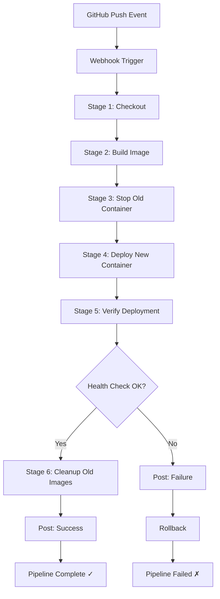

# Giải Thích Chi Tiết Jenkinsfile - Báo Cáo CI/CD

## 📋 Tổng Quan

Jenkinsfile là file cấu hình định nghĩa **CI/CD Pipeline** cho Jenkins sử dụng **Declarative Pipeline Syntax**. File này mô tả toàn bộ quy trình tự động từ lúc pull code từ GitHub cho đến khi deploy ứng dụng Flask thành công.

## 🏗️ Cấu Trúc Tổng Thể

```groovy
pipeline {
    agent any
    environment { ... }
    stages { ... }
    post { ... }
}
```

### 1. Pipeline Block (Dòng 1)

```groovy
pipeline {
    agent any
```

- **`pipeline`**: Khai báo đây là Declarative Pipeline
- **`agent any`**: Pipeline có thể chạy trên bất kỳ Jenkins agent nào có sẵn
  - Trong setup này, Jenkins chạy trên Docker container
  - `any` nghĩa là không yêu cầu agent đặc biệt

---

## 🌍 Environment Variables (Dòng 4-11)

```groovy
environment {
    IMAGE_NAME = 'flask-demo'
    CONTAINER_NAME = 'flask-app'
    APP_PORT = '5000'
    IMAGE_TAG = "${env.BUILD_NUMBER}-${new Date().format('yyyyMMdd-HHmmss')}"
}
```

### Mục đích
Định nghĩa các biến môi trường dùng chung cho toàn bộ pipeline.

### Chi tiết các biến

| Biến | Giá trị | Mục đích |
|------|---------|----------|
| `IMAGE_NAME` | `flask-demo` | Tên Docker image sẽ build |
| `CONTAINER_NAME` | `flask-app` | Tên container khi chạy |
| `APP_PORT` | `5000` | Port mapping cho Flask app |
| `IMAGE_TAG` | `1-20251225-151430` | Tag động cho versioning |

### IMAGE_TAG - Versioning Strategy

```groovy
IMAGE_TAG = "${env.BUILD_NUMBER}-${new Date().format('yyyyMMdd-HHmmss')}"
```

**Ví dụ**: Build số 5 vào ngày 25/12/2025 lúc 15:14:30
- Kết quả: `5-20251225-151430`

**Lợi ích**:
- ✅ Track được từng version deploy
- ✅ Dễ dàng rollback về version cũ
- ✅ Biết chính xác thời gian build

---

## 🔄 Stages - Các Giai Đoạn Pipeline

Pipeline có **6 stages** chính, thực thi tuần tự:

### Stage 1: Checkout (Dòng 14-19)

```groovy
stage('Checkout') {
    steps {
        echo 'Pulling code from GitHub...'
        checkout scm
    }
}
```

**Chức năng**: Pull source code từ GitHub repository

**Chi tiết**:
- `checkout scm`: SCM = Source Code Management
- Jenkins tự động pull code từ repo đã config
- Sử dụng branch đã chỉ định (main/master)

**Output**: Code mới nhất trong workspace

---

### Stage 2: Build Docker Image (Dòng 21-32)

```groovy
stage('Build Docker Image') {
    steps {
        script {
            echo "Building Docker image: ${IMAGE_NAME}:${IMAGE_TAG}"
            sh """
                docker build -t ${IMAGE_NAME}:${IMAGE_TAG} .
                docker tag ${IMAGE_NAME}:${IMAGE_TAG} ${IMAGE_NAME}:latest
            """
        }
    }
}
```

**Chức năng**: Build Docker image từ Dockerfile

**Quy trình**:

1. **Build image với tag cụ thể**:
   ```bash
   docker build -t flask-demo:5-20251225-151430 .
   ```
   - `-t`: Tag cho image
   - `.`: Build context (thư mục hiện tại)

2. **Tạo tag `latest`**:
   ```bash
   docker tag flask-demo:5-20251225-151430 flask-demo:latest
   ```
   - Tạo alias `latest` trỏ đến image vừa build
   - Dùng để deploy (luôn dùng tag `latest`)

**Kết quả**: 2 tags cho cùng 1 image
- `flask-demo:5-20251225-151430` (specific version)
- `flask-demo:latest` (current version)

---

### Stage 3: Stop Old Container (Dòng 34-44)

```groovy
stage('Stop Old Container') {
    steps {
        script {
            echo 'Stopping and removing old container if exists...'
            sh """
                docker stop ${CONTAINER_NAME} || true
                docker rm ${CONTAINER_NAME} || true
            """
        }
    }
}
```

**Chức năng**: Dừng và xóa container cũ trước khi deploy container mới

**Chi tiết**:

1. **Stop container**:
   ```bash
   docker stop flask-app || true
   ```
   - Dừng container đang chạy
   - `|| true`: Không fail nếu container không tồn tại

2. **Remove container**:
   ```bash
   docker rm flask-app || true
   ```
   - Xóa container đã stop
   - Giải phóng tên `flask-app` để dùng lại

**Tại sao cần stage này?**
- ❌ Không thể tạo 2 containers cùng tên
- ❌ Không thể bind cùng 1 port (5000)
- ✅ Phải xóa cũ trước khi tạo mới

---

### Stage 4: Deploy (Dòng 46-60)

```groovy
stage('Deploy') {
    steps {
        script {
            echo "Deploying new container: ${CONTAINER_NAME}"
            sh """
                docker run -d \
                    --name ${CONTAINER_NAME} \
                    -p ${APP_PORT}:5000 \
                    -e APP_VERSION=${IMAGE_TAG} \
                    --restart unless-stopped \
                    ${IMAGE_NAME}:latest
            """
        }
    }
}
```

**Chức năng**: Chạy container mới từ image vừa build

**Phân tích lệnh `docker run`**:

| Option | Giá trị | Ý nghĩa |
|--------|---------|---------|
| `-d` | - | Detached mode (chạy background) |
| `--name` | `flask-app` | Đặt tên container |
| `-p` | `5000:5000` | Port mapping: host:container |
| `-e` | `APP_VERSION=...` | Environment variable |
| `--restart` | `unless-stopped` | Auto restart policy |
| Image | `flask-demo:latest` | Image để chạy |

**Port Mapping**:
```
Host (máy local):5000  →  Container:5000
```
- Truy cập `http://localhost:5000` từ browser
- Request được forward vào container port 5000

**Restart Policy**:
- `unless-stopped`: Container tự động restart khi:
  - Docker daemon restart
  - Server reboot
  - Container crash
- **Trừ khi** user manually stop

**Environment Variable**:
- `APP_VERSION=${IMAGE_TAG}`: Truyền version vào container
- Flask app đọc biến này để hiển thị version

---

### Stage 5: Verify Deployment (Dòng 62-77)

```groovy
stage('Verify Deployment') {
    steps {
        script {
            echo 'Verifying deployment...'
            sleep(time: 5, unit: 'SECONDS')
            
            sh """
                curl -f http://localhost:${APP_PORT}/health || exit 1
            """
            
            echo 'Deployment successful! ✓'
        }
    }
}
```

**Chức năng**: Kiểm tra xem deployment có thành công không

**Quy trình**:

1. **Đợi container khởi động**:
   ```groovy
   sleep(time: 5, unit: 'SECONDS')
   ```
   - Container cần thời gian để start Flask app
   - Đợi 5 giây để app sẵn sàng

2. **Health Check**:
   ```bash
   curl -f http://localhost:5000/health || exit 1
   ```
   - `curl -f`: Fail nếu HTTP status không phải 2xx
   - Call endpoint `/health` của Flask app
   - `|| exit 1`: Exit với code 1 nếu curl fail
   - **Nếu fail**: Pipeline dừng lại, báo lỗi

**Response mong đợi từ `/health`**:
```json
{
    "status": "healthy",
    "version": "5-20251225-151430"
}
```

**Tại sao quan trọng?**
- ✅ Đảm bảo app thực sự chạy được
- ✅ Phát hiện lỗi ngay sau deploy
- ✅ Tránh deploy broken code

---

### Stage 6: Cleanup Old Images (Dòng 79-89)

```groovy
stage('Cleanup Old Images') {
    steps {
        script {
            echo 'Cleaning up old Docker images...'
            sh """
                docker images ${IMAGE_NAME} --format '{{.Tag}}' | grep -v latest | tail -n +4 | xargs -r -I {} docker rmi ${IMAGE_NAME}:{} || true
            """
        }
    }
}
```

**Chức năng**: Xóa các Docker images cũ, chỉ giữ lại 3 images gần nhất

**Phân tích lệnh**:

```bash
docker images flask-demo --format '{{.Tag}}'
```
- List tất cả tags của image `flask-demo`
- Output:
  ```
  latest
  5-20251225-151430
  4-20251225-140000
  3-20251225-130000
  2-20251225-120000
  ```

```bash
| grep -v latest
```
- Loại bỏ tag `latest`
- Output:
  ```
  5-20251225-151430
  4-20251225-140000
  3-20251225-130000
  2-20251225-120000
  ```

```bash
| tail -n +4
```
- Bỏ qua 3 dòng đầu (giữ lại 3 images mới nhất)
- Output:
  ```
  2-20251225-120000
  ```

```bash
| xargs -r -I {} docker rmi flask-demo:{} || true
```
- `xargs`: Chuyển input thành arguments
- `-r`: Không chạy nếu input rỗng
- `-I {}`: Placeholder cho mỗi tag
- `docker rmi`: Remove image
- `|| true`: Không fail nếu lỗi

**Tại sao cần cleanup?**
- 💾 Tiết kiệm disk space
- 🧹 Tránh tích tụ images cũ
- ⚡ Giữ hệ thống gọn gàng

---

## 📬 Post Actions (Dòng 92-109)

Post block chạy **sau khi tất cả stages hoàn thành**, dựa trên kết quả pipeline.

### Success Block (Dòng 93-97)

```groovy
success {
    echo '✓ Pipeline completed successfully!'
    echo "Application is running at: http://localhost:${APP_PORT}"
    echo "Version: ${IMAGE_TAG}"
}
```

**Khi nào chạy**: Tất cả stages thành công

**Chức năng**:
- Thông báo thành công
- Hiển thị URL để truy cập app
- Hiển thị version vừa deploy

**Output**:
```
✓ Pipeline completed successfully!
Application is running at: http://localhost:5000
Version: 5-20251225-151430
```

---

### Failure Block (Dòng 98-105)

```groovy
failure {
    echo '✗ Pipeline failed!'
    sh """
        docker stop ${CONTAINER_NAME} || true
        docker rm ${CONTAINER_NAME} || true
    """
}
```

**Khi nào chạy**: Bất kỳ stage nào fail

**Chức năng**: **Rollback**
- Thông báo lỗi
- Stop và remove container mới (có thể bị lỗi)
- Giữ container cũ đang chạy (nếu có)

**Tại sao cần rollback?**
- ❌ Container mới có thể không chạy được
- ✅ Tránh để hệ thống trong trạng thái lỗi
- ✅ Có thể deploy lại sau khi fix

---

### Always Block (Dòng 106-108)

```groovy
always {
    echo 'Pipeline execution finished.'
}
```

**Khi nào chạy**: **Luôn luôn**, bất kể success hay failure

**Chức năng**:
- Log kết thúc pipeline
- Có thể dùng để cleanup resources
- Send notifications (email, Slack, etc.)

---

## 🔄 Workflow Tổng Thể



---

## 📊 Timeline Execution

| Stage | Thời gian ước tính | Mô tả |
|-------|-------------------|-------|
| 1. Checkout | ~5s | Pull code từ GitHub |
| 2. Build Image | ~30-60s | Build Docker image |
| 3. Stop Old Container | ~2s | Stop & remove container cũ |
| 4. Deploy | ~3s | Start container mới |
| 5. Verify | ~8s | Sleep 5s + health check |
| 6. Cleanup | ~5s | Remove old images |
| **Total** | **~1-2 phút** | Toàn bộ pipeline |

---

## 🎯 Ưu Điểm Của Pipeline Này

### 1. **Automation Hoàn Toàn**
- ✅ Không cần manual intervention
- ✅ Push code → Auto deploy

### 2. **Zero Downtime Deployment**
- ✅ Build image trước
- ✅ Stop old → Start new (downtime < 5s)

### 3. **Versioning & Traceability**
- ✅ Mỗi build có unique tag
- ✅ Biết chính xác version đang chạy
- ✅ Dễ dàng rollback

### 4. **Health Check**
- ✅ Verify deployment thành công
- ✅ Fail fast nếu có lỗi

### 5. **Resource Management**
- ✅ Auto cleanup old images
- ✅ Tiết kiệm disk space

### 6. **Error Handling**
- ✅ Rollback khi fail
- ✅ Clear error messages

---

## 🔧 Customization Options

### Thêm Testing Stage

```groovy
stage('Run Tests') {
    steps {
        script {
            echo 'Running unit tests...'
            sh """
                docker run --rm ${IMAGE_NAME}:${IMAGE_TAG} python -m pytest tests/
            """
        }
    }
}
```

### Thêm Notification

```groovy
post {
    success {
        emailext (
            subject: "✓ Deploy Success: ${env.JOB_NAME} #${env.BUILD_NUMBER}",
            body: "Application deployed successfully!",
            to: "team@example.com"
        )
    }
}
```

### Multi-Environment Deployment

```groovy
stage('Deploy to Staging') {
    when {
        branch 'develop'
    }
    steps {
        // Deploy to staging server
    }
}

stage('Deploy to Production') {
    when {
        branch 'main'
    }
    steps {
        // Deploy to production server
    }
}
```

---

## 📝 Kết Luận

Jenkinsfile này implement một **complete CI/CD pipeline** với:

1. ✅ **Continuous Integration**: Auto build khi có code mới
2. ✅ **Continuous Deployment**: Auto deploy sau khi build thành công
3. ✅ **Quality Assurance**: Health check verification
4. ✅ **Rollback Strategy**: Revert khi deployment fail
5. ✅ **Resource Optimization**: Cleanup old images

Pipeline này đảm bảo:
- 🚀 **Fast deployment**: 1-2 phút từ push đến production
- 🔒 **Reliability**: Health check và rollback
- 📊 **Traceability**: Version tracking
- 🧹 **Maintainability**: Auto cleanup

Đây là một **production-ready CI/CD pipeline** phù hợp cho các dự án Flask và có thể mở rộng cho các framework khác.
