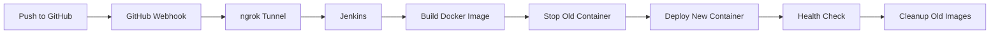

# Flask CI/CD Demo với Jenkins

Demo project cho CI/CD pipeline sử dụng Flask, Jenkins, Docker và GitHub webhooks.

## 📋 Tổng quan

Project này demo một CI/CD pipeline hoàn chỉnh:
- **Flask**: Web application đơn giản
- **Docker**: Containerization
- **Jenkins**: CI/CD automation
- **GitHub**: Source control với webhooks
- **ngrok**: Tunnel cho webhook từ GitHub đến Jenkins local

## 🚀 Tính năng

Khi push code lên GitHub, Jenkins sẽ tự động:
1. ✅ Pull code mới nhất
2. 🔨 Build Docker image mới
3. 🛑 Stop container cũ
4. 🚀 Deploy container mới
5. ✓ Verify deployment với health check
6. 🧹 Cleanup old images

## 📦 Yêu cầu

- Docker Desktop (đã cài đặt và đang chạy)
- Git
- ngrok account (free tier)
- GitHub repository

## 🛠️ Cài đặt

### 1. Clone repository

```bash
git clone <your-repo-url>
cd jenkins-cicd
```

### 2. Khởi động Jenkins

```bash
docker-compose up -d
```

Đợi khoảng 1-2 phút để Jenkins khởi động hoàn toàn.

### 3. Truy cập Jenkins

Mở browser và truy cập: `http://localhost:8080`

**Lấy initial admin password:**

```bash
docker exec jenkins-cicd cat /var/jenkins_home/secrets/initialAdminPassword
```

### 4. Setup Jenkins

1. Paste initial admin password
2. Chọn **"Install suggested plugins"**
3. Tạo admin user
4. Giữ nguyên Jenkins URL: `http://localhost:8080`

### 5. Cài đặt Docker Pipeline Plugin

1. Vào **Manage Jenkins** → **Manage Plugins**
2. Tab **Available**, tìm "Docker Pipeline"
3. Chọn và install
4. Restart Jenkins nếu cần

### 6. Tạo Pipeline Job

1. Click **New Item**
2. Nhập tên: `flask-cicd-pipeline`
3. Chọn **Pipeline**
4. Click **OK**

**Configure Pipeline:**

- **General**: Check ✓ **GitHub project**, nhập URL repo
- **Build Triggers**: Check ✓ **GitHub hook trigger for GITScm polling**
- **Pipeline**:
  - Definition: **Pipeline script from SCM**
  - SCM: **Git**
  - Repository URL: `<your-github-repo-url>`
  - Credentials: Add GitHub credentials nếu private repo
  - Branch: `*/main` (hoặc `*/master`)
  - Script Path: `Jenkinsfile`

Click **Save**

### 7. Setup ngrok

**Download và cài đặt ngrok:**

```bash
# Download từ https://ngrok.com/download
# Hoặc dùng chocolatey trên Windows:
choco install ngrok
```

**Authenticate ngrok:**

```bash
ngrok config add-authtoken <your-auth-token>
```

**Khởi động tunnel:**

```bash
ngrok http 8080
```

Bạn sẽ thấy output như:

```
Forwarding  https://xxxx-xxxx-xxxx.ngrok-free.app -> http://localhost:8080
```

Copy URL `https://xxxx-xxxx-xxxx.ngrok-free.app` này.

### 8. Setup GitHub Webhook

1. Vào GitHub repository → **Settings** → **Webhooks**
2. Click **Add webhook**
3. **Payload URL**: `https://xxxx-xxxx-xxxx.ngrok-free.app/github-webhook/`
   - ⚠️ Chú ý có dấu `/` ở cuối
4. **Content type**: `application/json`
5. **Which events**: Chọn **Just the push event**
6. Check ✓ **Active**
7. Click **Add webhook**

## 🧪 Test CI/CD Pipeline

### Test 1: Trigger thủ công

1. Vào Jenkins job `flask-cicd-pipeline`
2. Click **Build Now**
3. Xem logs trong **Console Output**

### Test 2: Trigger tự động qua webhook

1. Sửa file `app.py`, ví dụ thay đổi message:

```python
'message': 'Chào mừng đến với Flask CI/CD Demo v2!',
```

2. Commit và push:

```bash
git add .
git commit -m "Update welcome message"
git push origin main
```

3. Jenkins sẽ tự động trigger build
4. Kiểm tra tại `http://localhost:5000`

## 📡 API Endpoints

- `GET /` - Home page với version info
- `GET /health` - Health check endpoint
- `GET /api/info` - Application information

**Test với curl:**

```bash
# Health check
curl http://localhost:5000/health

# Get info
curl http://localhost:5000/api/info
```

## 🐛 Troubleshooting

### Jenkins không thể build Docker image

**Lỗi**: `docker: command not found`

**Giải pháp**: Đảm bảo Docker socket được mount đúng trong `docker-compose.yml`

### Container không start

**Kiểm tra logs:**

```bash
docker logs flask-app
```

**Kiểm tra port đã được sử dụng:**

```bash
netstat -ano | findstr :5000
```

### Webhook không trigger

1. Kiểm tra ngrok đang chạy: `ngrok http 8080`
2. Kiểm tra webhook delivery trong GitHub Settings → Webhooks
3. Đảm bảo URL có `/github-webhook/` ở cuối

### Build thành công nhưng không thấy thay đổi

**Clear browser cache** hoặc test với curl:

```bash
curl http://localhost:5000
```

## 📁 Cấu trúc Project

```
jenkins-cicd/
├── app.py                 # Flask application
├── requirements.txt       # Python dependencies
├── Dockerfile            # Docker image definition
├── Jenkinsfile           # CI/CD pipeline
├── docker-compose.yml    # Jenkins setup
├── .gitignore           # Git ignore rules
└── README.md            # This file
```

## 🔄 Workflow



## 📝 Notes

- Jenkins data được persist trong Docker volume `jenkins_home`
- Flask app chạy trên port 5000
- Jenkins UI chạy trên port 8080
- Mỗi build tạo image tag mới với format: `BUILD_NUMBER-TIMESTAMP`
- Pipeline tự động cleanup, chỉ giữ lại 3 images gần nhất

## 🤝 Contributing

1. Fork repository
2. Tạo feature branch
3. Commit changes
4. Push và tạo Pull Request

## 📄 License

MIT License
